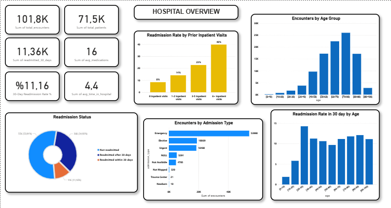
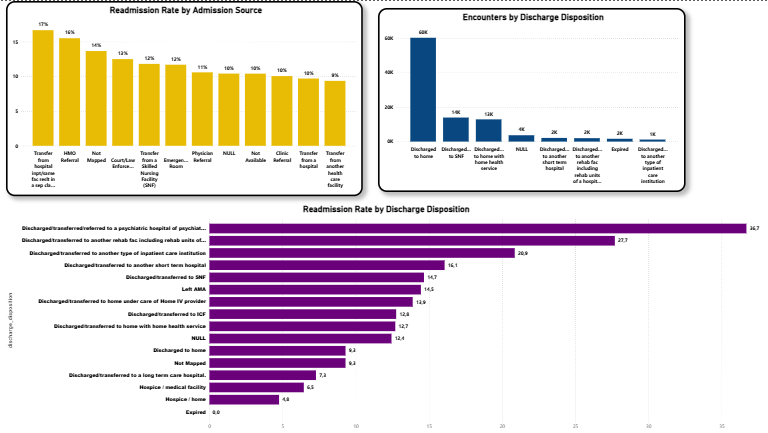
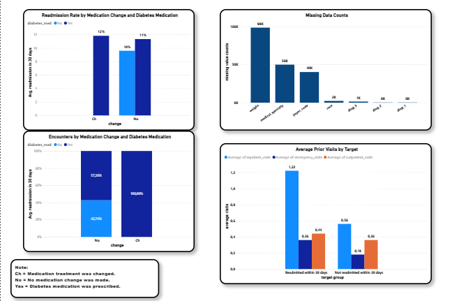
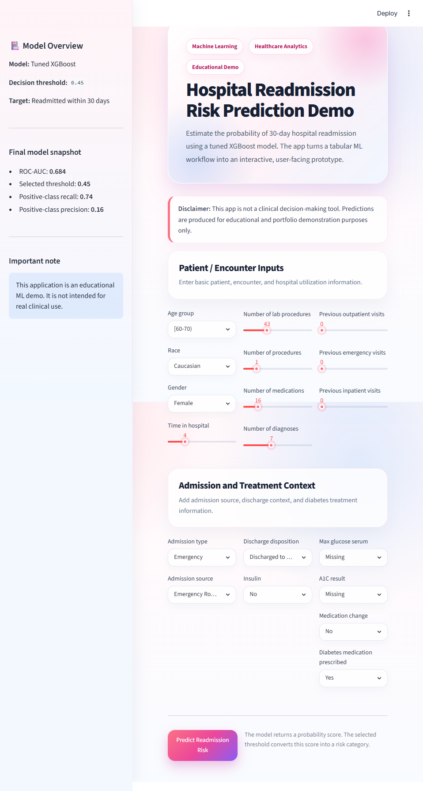
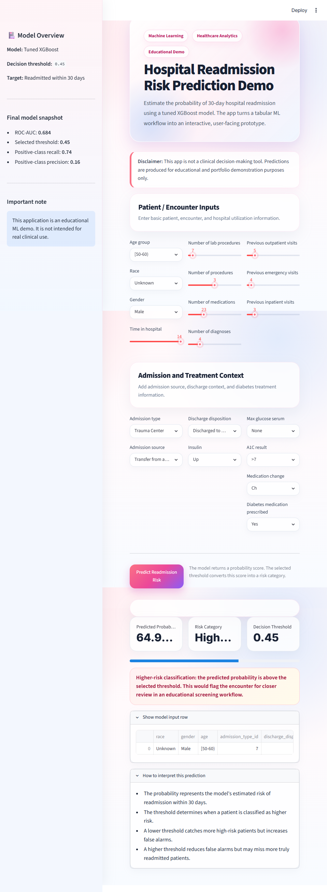

# Hospital Readmission Risk Prediction

An end-to-end healthcare analytics and machine learning project focused on predicting whether a diabetic patient is likely to be readmitted to the hospital within 30 days.

This project combines SQL-based data analysis, Power BI dashboarding, machine learning model development, threshold tuning, and a Streamlit web application.

> **Disclaimer:** This project is an educational machine learning demo. It is not intended for real clinical use or medical decision-making.

---

## Project Overview

Hospital readmission is an important healthcare problem because early readmissions may indicate patient risk, care quality issues, or the need for better follow-up planning.

The goal of this project is to predict whether a patient will be readmitted within 30 days after hospital discharge.

The target variable was created as:

```text
readmitted_30_days = 1 → readmitted == "<30"
readmitted_30_days = 0 → readmitted == "NO" or ">30"
```

The project follows this workflow:

```text
Healthcare Dataset
→ PostgreSQL / DBeaver
→ SQL Analytical Views
→ Power BI Dashboard
→ Machine Learning Modeling in Colab
→ Tuned XGBoost Model
→ Streamlit Prediction App
```

---

## Tools & Technologies

* Python
* Pandas
* NumPy
* Scikit-learn
* XGBoost
* Joblib
* Streamlit
* PostgreSQL
* DBeaver
* SQL
* Power BI
* Google Colab
* Git / GitHub

---

## Repository Structure

```text
hospital-readmission-risk-prediction/
├── dashboard/
│   └── hospital_readmission_dashboard.pbix
│
├── data/
│   ├── diabetic_data.csv
│   └── IDS_mapping.csv
│
├── hospital_readmission_app/
│   ├── app.py
│   ├── requirements.txt
│   ├── README.md
│   └── models/
│       ├── tuned_xgboost_readmission_pipeline.pkl
│       └── final_threshold.pkl
│
├── notebook/
│   └── hospital_readmission.ipynb
│
├── queries/
│   ├── 00_database_checks.sql
│   ├── 01_clean_mapping_views.sql
│   ├── 02_patient_encounters_enriched_view.sql
│   ├── 03_data_quality_checks.sql
│   ├── 04_readmission_overview_views.sql
│   ├── 05_risk_factor_analysis_views.sql
│   ├── 06_powerbi_export_checks.sql
│   ├── 07_values_summary.sql
│   └── README_queries.md
│
├── screenshots/
│   ├── dash_b1.png
│   ├── dash_b2.png
│   ├── dash_b3.png
│   ├── ss1.png
│   └── ss2.png
│
├── .gitignore
└── README.md
```

---

## Dataset

The project uses the **Diabetes 130-US Hospitals** dataset.

The dataset contains hospital encounter records for diabetic patients, including demographics, admission details, discharge information, medication usage, diagnosis codes, prior visits, and readmission status.

Main files:

```text
diabetic_data.csv
IDS_mapping.csv
```

The original target column is:

```text
readmitted
```

Target distribution:

```text
NO     → Not readmitted
>30    → Readmitted after 30 days
<30    → Readmitted within 30 days
```

The positive class is the minority class:

```text
Readmitted within 30 days ≈ 11.16%
```

Because of this imbalance, accuracy alone is not a reliable evaluation metric.

---

## SQL & Data Modeling

The dataset was imported into PostgreSQL using DBeaver.

The `IDS_mapping.csv` file was used to create readable mapping views for:

```text
admission_type_id
discharge_disposition_id
admission_source_id
```

The main enriched SQL view was created as:

```text
vw_patient_encounters_enriched
```

This view joins patient encounter records with mapping descriptions and prepares a clean analytical layer for Power BI.

Additional SQL views were created for:

* KPI overview
* Readmission status distribution
* Readmission rate by age group
* Readmission rate by admission type
* Readmission rate by admission source
* Readmission rate by discharge disposition
* Medication status analysis
* Prior visit analysis
* Missing value summary
* ML readiness checks

---

## Power BI Dashboard

The Power BI dashboard contains three pages.

### Page 1 — Hospital Overview

This page provides a high-level summary of the hospital readmission problem.

Included visuals:

* Total encounters
* Total patients
* 30-day readmission count
* 30-day readmission rate
* Average medications
* Average time in hospital
* Readmission status distribution
* Encounters by admission type
* Readmission rate by age group
* Readmission rate by prior inpatient visits



---

### Page 2 — Encounter Risk Factors

This page focuses on encounter-level risk factors.

Included visuals:

* Readmission rate by admission source
* Encounters by discharge disposition
* Readmission rate by discharge disposition

The goal of this page is to compare readmission rates together with encounter volume, because a category with a high rate but very low patient count may not be reliable enough for broad conclusions.



---

### Page 3 — Medication & ML Readiness

This page focuses on medication-related variables and machine learning preparation.

Included visuals:

* Readmission rate by medication change and diabetes medication
* Diabetes medication mix by medication change
* Missing data counts
* Average prior visits by target

Important missing value findings:

```text
weight              → very high missing rate
medical_specialty   → high missing rate
payer_code          → high missing rate
race                → moderate missing rate
diag_1 / diag_2 / diag_3 → lower missing rates
```



---

## Machine Learning Workflow

The machine learning workflow was developed in Google Colab.

Main steps:

1. Load and inspect the dataset
2. Create binary target variable
3. Analyze class imbalance
4. Handle missing values
5. Split data using stratified train/test split
6. Build preprocessing pipelines
7. Train multiple models
8. Compare model performance
9. Tune hyperparameters
10. Tune decision threshold
11. Save the final model pipeline
12. Build a Streamlit app

---

## Preprocessing Strategy

The dataset contained both real missing values and missing values represented as `"?"`.

Columns dropped:

```text
encounter_id
patient_nbr
readmitted
weight
payer_code
medical_specialty
```

Columns filled with `"Unknown"`:

```text
race
diag_1
diag_2
diag_3
```

Columns filled with `"Missing"`:

```text
max_glu_serum
A1Cresult
```

The final model used:

```text
44 input features
11 numeric features
33 categorical features
```

---

## Models Tested

Several models were trained and compared:

* Logistic Regression
* Logistic Regression with Yeo-Johnson transformation
* Random Forest
* Tuned Random Forest
* HistGradientBoostingClassifier
* XGBoost
* Tuned XGBoost
* Neural Network baseline

Because the dataset is tabular and imbalanced, tree-based boosting models performed better than the neural network baseline.

---

## Final Model

The final selected model was:

```text
Tuned XGBoost Classifier
```

Why XGBoost?

* Strong ROC-AUC performance
* Good recall for the minority class
* Suitable for structured/tabular healthcare data
* Handles non-linear patterns well
* Supports class imbalance handling through `scale_pos_weight`
* Produces probability scores suitable for threshold tuning

Best tuned parameters:

```text
subsample: 0.8
n_estimators: 500
min_child_weight: 5
max_depth: 5
learning_rate: 0.01
gamma: 0.5
colsample_bytree: 0.7
```

---

## Threshold Tuning

The default threshold of `0.50` was not treated as automatically optimal.

Since this is a healthcare risk screening problem, recall was prioritized to reduce missed high-risk patients.

Final selected threshold:

```text
0.45
```

Final model performance with threshold `0.45`:

```text
Positive class precision: 0.16
Positive class recall:    0.74
Positive class F1-score:  0.26
ROC-AUC:                  0.684
```

Final confusion matrix:

```text
[[9231 8852]
 [ 589 1682]]
```

Interpretation:

The model identified approximately 74% of patients who were readmitted within 30 days. However, precision remained low, meaning the model also produced many false positives.

This trade-off was accepted because the project is framed as an educational risk-screening demo, where missing high-risk patients is more costly than flagging extra patients for review.

---

## Streamlit App

A Streamlit application was built to make the model accessible through a simple user interface.

The app allows users to enter patient encounter information and returns:

* Estimated readmission risk probability
* Lower Risk / Higher Risk classification
* Model threshold explanation
* Input summary
* Educational disclaimer

The app uses the saved model pipeline:

```text
tuned_xgboost_readmission_pipeline.pkl
final_threshold.pkl
```

App UI direction:

```text
Soft Rose Medical Theme
```

Design goals:

* Clean healthcare-focused interface
* Human-centered and calming visual style
* Clear risk interpretation
* Simple input layout
* Portfolio-friendly presentation





---

## How to Run the Streamlit App

Navigate to the app folder:

```bash
cd hospital_readmission_app
```

Install dependencies:

```bash
pip install -r requirements.txt
```

Run the app:

```bash
streamlit run app.py
```

---

## Key Insights

* The 30-day readmission class is highly imbalanced, representing approximately 11% of encounters.
* Accuracy alone is not enough for this problem.
* Recall, precision, F1-score, and ROC-AUC are more meaningful for evaluating model performance.
* Prior hospital utilization features such as `number_inpatient`, `number_outpatient`, and `number_emergency` are important indicators.
* Some discharge disposition and admission source categories show higher readmission risk.
* Medication change and diabetes medication status provide useful context for analysis.
* Tree-based boosting models performed better than the neural network baseline on this structured tabular dataset.
* Threshold tuning is necessary when business or healthcare priorities differ from default classification settings.

---

## Project Outcome

This project demonstrates an end-to-end healthcare analytics workflow:

```text
SQL data preparation
+ Power BI dashboarding
+ machine learning model comparison
+ class imbalance handling
+ threshold tuning
+ model deployment with Streamlit
```

It shows both analytical thinking and practical machine learning implementation.

The final result is a portfolio-ready case study that connects business intelligence, healthcare analytics, and predictive modeling in one complete project.

---

## Limitations

* This project is educational and should not be used for real clinical decisions.
* The model is trained on historical data and may not generalize to all hospital systems.
* Diagnosis codes were used in simplified form.
* Precision is low, so the model produces many false positives.
* More clinical validation, feature engineering, and external testing would be required for real-world use.

---

## Future Improvements

Possible next steps:

* Improve diagnosis code grouping
* Add SHAP-based model explainability
* Improve precision-recall balance
* Add more advanced feature engineering
* Test calibration of predicted probabilities
* Deploy the app online
* Add Docker support
* Add a FastAPI backend
* Build a more detailed clinical risk explanation page

---

## Portfolio Summary

This is an end-to-end healthcare analytics and machine learning project where raw hospital encounter data was imported into PostgreSQL, transformed into SQL analytical views, visualized in Power BI, modeled using multiple machine learning algorithms, and deployed as an educational Streamlit app for 30-day hospital readmission risk prediction.
